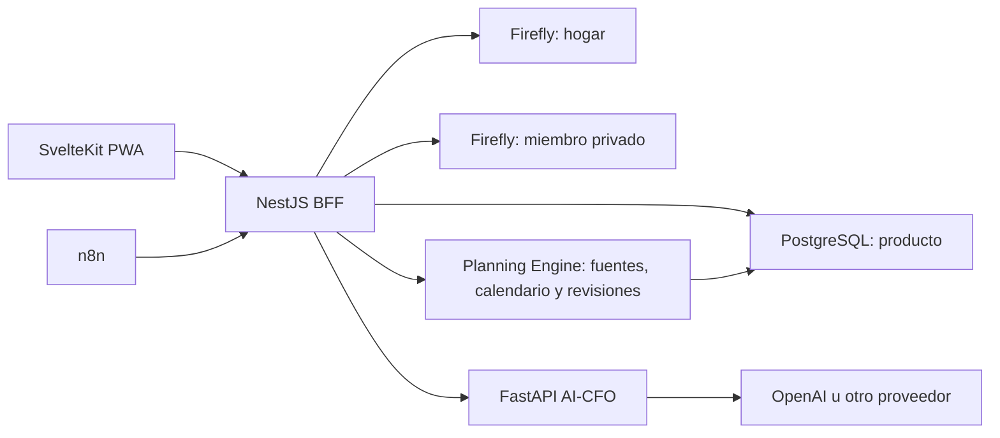

# Arquitectura

## Límites de responsabilidad



Firefly es la fuente canónica de movimientos reales. PostgreSQL es la fuente canónica de políticas de bolsillos, visibilidad, atribuciones, planificación y escenarios. El AI-CFO es estrictamente de lectura.

## Planificación financiera

El módulo distingue fuente reutilizable, ingreso esperado fechado, plan, asignación y revisión. Esto evita convertir primas o alquileres futuros en saldo disponible y conserva la historia de acuerdos. Las asignaciones usan cantidad fija, porcentaje o remanente y solo pueden enlazar objetos con el mismo hogar, alcance y moneda. Consulte [el diseño completo](PLANNING.md).

## Privacidad

Las consultas de bolsillos aplican siempre:

```text
household_id = identidad.household_id
AND (visibility = household OR owner_member_id = identidad.member_id)
```

Los datos privados se guardan en un contexto Firefly separado. Si dinero común financia un propósito privado, el libro compartido recibe una descripción genérica y el libro privado conserva el detalle. La API responde `404` tanto para inexistencia como para falta de visibilidad.

La incorporación de Row-Level Security con un rol PostgreSQL de runtime separado está reservada para el hardening previo a producción comercial. En este MVP, el aislamiento se aplica en los repositorios de la API y se cubre mediante pruebas del dominio.

## Flujo de una transacción

1. La API autentica miembro y hogar.
2. Valida `Idempotency-Key`, cantidad y acceso al bolsillo.
3. Selecciona libro `household` o `private`.
4. Firefly registra el movimiento con `external_id` idempotente.
5. PostgreSQL guarda la atribución a bolsillo, categoría y pagador.
6. Analytics solo agrega movimientos permitidos por el alcance solicitado.

## AI-CFO

La API construye un snapshot mínimo. No se envían números de cuenta, nombres reales, notas libres ni datos privados en un análisis de hogar. El proveedor devuelve `InsightBundle`, el servicio valida todas las referencias de evidencia y rechaza fuentes de noticias no incluidas en la entrada.

El modelo OpenAI predeterminado es configurable. La configuración inicial usa `gpt-5.6-terra` por equilibrio entre calidad y coste; la aplicación usa Responses API con Structured Outputs y esfuerzo `low`. Cambiar el modelo no altera el contrato interno.

## Evolución SaaS

Todas las entidades incorporan `householdId`. La evolución comercial debe añadir control plane, aprovisionamiento de un Firefly aislado por hogar, RLS obligatorio con rol de runtime, auditoría inmutable, consentimiento, facturación y adaptadores Open Banking.
