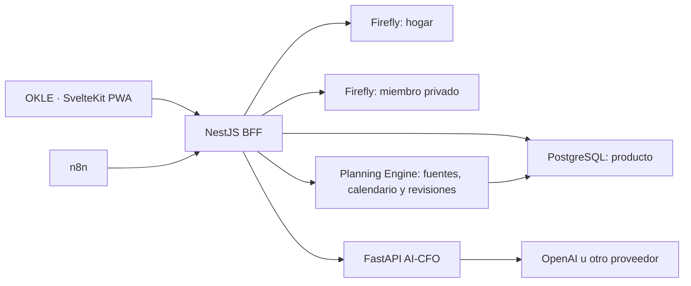
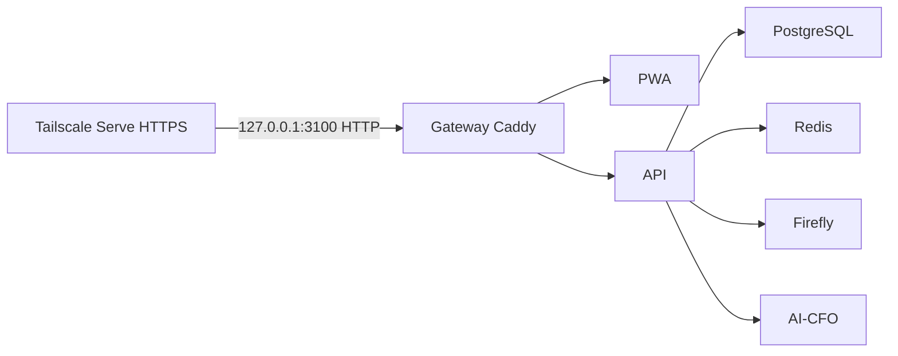

# Arquitectura

## Límites de responsabilidad



Firefly es la fuente canónica de movimientos reales. PostgreSQL es la fuente canónica de políticas de bolsillos, visibilidad, atribuciones, planificación y escenarios. El AI-CFO es estrictamente de lectura.

## Topologías de despliegue

`docker-compose.yml` no publica puertos y define el núcleo sin proveedores opcionales. `docker-compose.private.yml` añade un gateway HTTP enlazado exclusivamente a `127.0.0.1`, pensado para TLS terminado por Tailscale. `docker-compose.public.yml` añade Caddy con 80/443. `docker-compose.keycloak.yml` se combina únicamente con `AUTH_MODE=keycloak`. `docker-compose.n8n.yml` contiene servicio, secretos y volumen exclusivos de n8n y solo se combina con `ENABLE_BUNDLED_N8N=true`; el Compose base no los interpola.



`APP_ORIGIN` conserva esquema, hostname y puerto externo; las rutas internas usan DNS Compose. `COMPOSE_PROJECT_NAME` separa completamente dev y producción.

## Límite de autenticación

Los controladores financieros reciben siempre un `Actor` normalizado (`id`, `email`, `householdMemberId`, `householdId`, roles y proveedor). Un único guard resuelve ese actor desde una sesión local o un JWT Keycloak; la autorización de bolsillos y hogar no conoce el proveedor.

En modo local, `LocalUser` es una relación uno a uno con `Member`, no un segundo modelo de hogar. La contraseña usa scrypt con salt aleatorio; Redis conserva únicamente sesiones opacas con TTL, versión de contraseña y token CSRF. PostgreSQL conserva credenciales hash y Redis permite revocación inmediata. En modo Keycloak se mantiene la verificación JWKS y el flujo PKCE existente.

## Planificación financiera

El módulo distingue fuente reutilizable, ingreso esperado fechado, plan, asignación y revisión. Esto evita convertir primas o alquileres futuros en saldo disponible y conserva la historia de acuerdos. Las asignaciones usan cantidad fija, porcentaje o remanente y solo pueden enlazar objetos con el mismo hogar, alcance y moneda. Consulte [el diseño completo](PLANNING.md).

## Privacidad

Las consultas de bolsillos aplican siempre:

```text
household_id = identidad.household_id
AND (visibility = household OR owner_member_id = identidad.member_id)
```

Los datos privados se guardan en un contexto Firefly separado. Si dinero común financia un propósito privado, el libro compartido recibe una descripción genérica y el libro privado conserva el detalle. La API responde `404` tanto para inexistencia como para falta de visibilidad.

La incorporación de Row-Level Security con un rol PostgreSQL de runtime separado está reservada para el hardening previo a producción comercial. En este MVP, el aislamiento se aplica en los repositorios de la API y se cubre mediante pruebas del dominio.

## Flujo de una transacción

1. La API autentica miembro y hogar.
2. Valida `Idempotency-Key`, cantidad y acceso al bolsillo.
3. Selecciona libro `household` o `private`.
4. PostgreSQL crea una atribución `pending` con la clave idempotente.
5. Firefly registra el movimiento con `external_id` idempotente.
6. PostgreSQL marca `synchronized`, crea el evento del bolsillo y actualiza su reserva. Si falla, conserva `failed` con un error sanitizado para reintento/reconciliación.
7. Analytics solo agrega movimientos permitidos por el alcance solicitado.

Una asignación común a un propósito privado genera un movimiento compartido genérico `Asignación personal — nombre` y mantiene comercio, categoría, bolsillo y descripción únicamente en el libro privado. La clave única de Firefly incluye alcance, pagador e identificador remoto para evitar colisiones entre contextos privados independientes.

## Cuentas y onboarding

`GET /v1/accounts` usa `Promise.allSettled`: un PAT privado ausente o inválido no impide utilizar el libro compartido. Crear, editar, probar o archivar una cuenta siempre pasa por el BFF y selecciona el token servidor correspondiente; el navegador nunca lo recibe. Firefly continúa siendo la fuente de verdad del saldo.

El onboarding no duplica configuración. Calcula su estado desde Household/Member, disponibilidad de PAT, cuentas Firefly, fuentes de ingreso, bolsillos y estado AI-CFO. Marcarlo completo solo guarda una fecha; se puede volver a abrir como diagnóstico.

## AI-CFO

La API construye un snapshot mínimo. No se envían números de cuenta, nombres reales, notas libres ni datos privados en un análisis de hogar. El proveedor devuelve `InsightBundle`, el servicio valida todas las referencias de evidencia y rechaza fuentes de noticias no incluidas en la entrada.

Los adaptadores actuales son `openai`, `gemini`, `openai_compatible`, `deterministic` y `disabled`. El genérico cubre NVIDIA NIM, Groq, OpenRouter, Together y gateways como LiteLLM mediante Chat Completions, con modos `json_schema`, `json_object` o `prompt`. OpenAI usa Responses API con Structured Outputs; Gemini usa salida JSON estructurada. La salida se valida de nuevo con Pydantic y contra los `evidenceIds`. El BFF persiste proveedor, modelo, fecha, alcance, período, prioridad, confianza y acción sugerida, sin almacenar ni exponer claves.

Referencias de contrato: [Structured Outputs de OpenAI](https://developers.openai.com/api/docs/guides/structured-outputs) y [Structured outputs de Gemini](https://ai.google.dev/gemini-api/docs/structured-output?lang=rest).

## Evolución SaaS

Todas las entidades incorporan `householdId`. La evolución comercial debe añadir control plane, aprovisionamiento de un Firefly aislado por hogar, RLS obligatorio con rol de runtime, auditoría inmutable, consentimiento, facturación y adaptadores Open Banking.
