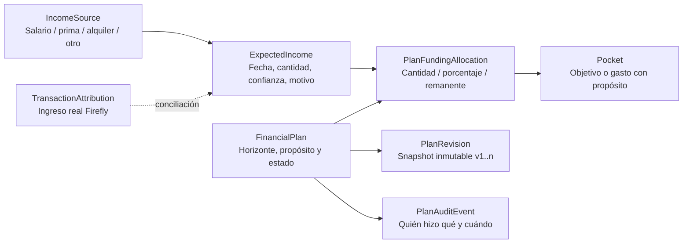

# Módulo de planificación financiera

## Propósito

El módulo conserva la memoria de las decisiones financieras del hogar. Responde cuatro preguntas independientes:

1. **¿De dónde vendrá?** Fuente reutilizable: salario, prima, alquiler, rendimiento, negocio u otra definida por el usuario.
2. **¿Cuándo y cuánto esperamos?** Ocurrencia fechada con cantidad, moneda, probabilidad y estado `planned | confirmed | received | cancelled`.
3. **¿Qué decidimos hacer?** Plan con asignaciones priorizadas hacia bolsillos, motivo y horizonte.
4. **¿Qué cambió después?** Revisiones inmutables con versión, autor, fecha, nota y snapshot completo.

Planificar nunca crea un saldo bancario. Firefly continúa siendo la fuente canónica de ingresos efectivamente recibidos; el módulo representa expectativas y acuerdos.

## Principios adaptados

- **Intención antes del gasto.** La interfaz permite separar costes fijos, ahorro, inversión y disfrute como clasificación opcional, inspirada en el _Conscious Spending Plan_. No impone porcentajes universales: cada hogar define sus reglas y márgenes. Referencia: [Conscious Spending Basics](https://www.iwillteachyoutoberich.com/conscious-spending-basics/).
- **Dinero alineado con valores.** `purpose`, `rationale` y `decisionNote` son obligatorios. Se adopta la idea de revisar si el uso del dinero compensa el esfuerzo y los objetivos vitales, sin copiar una metodología cerrada. Referencia: [Your Money or Your Life — resumen de la autora](https://vickirobin.com/your-money-or-your-life-summary/).
- **Margen para la incertidumbre.** Un ingreso estimado tiene probabilidad y se mantiene separado de uno confirmado o recibido. Ningún cálculo ponderado se presenta como saldo disponible. El énfasis conductual y el reconocimiento del riesgo se inspiran en _The Psychology of Money_. Referencia: [Harriman House](https://www.harriman-house.com/press/full/3931).
- **Horizonte y riesgo deben coincidir.** El plazo del objetivo se muestra explícitamente; la app no debe sugerir activos volátiles para dinero de corto plazo. Referencia educativa: [Investor.gov — Asset Allocation and Diversification](https://www.investor.gov/introduction-investing/getting-started/asset-allocation).
- **La pareja conserva contexto, no solo cifras.** Cada revisión explica qué acordaron y por qué. Esto reduce discusiones basadas en recuerdos distintos y permite reuniones financieras periódicas.

## Modelo



### Reglas de privacidad

- Todo objeto es `household` o `private`; el valor predeterminado es `household`.
- Un plan compartido solo puede enlazar fuentes, ingresos y bolsillos compartidos de la misma moneda.
- Un plan privado solo puede enlazar objetos privados del propietario.
- Los IDs ajenos devuelven `404` y no aparecen en timeline, exportación, analytics o IA del hogar.
- Una futura asignación común hacia un propósito privado deberá usar el patrón ya definido: monto genérico visible y finalidad oculta. La primera versión evita esa combinación hasta implementar el asiento redactado y su saga.

## Horizonte operativo

El calendario deriva automáticamente:

```text
today → this_week → this_month → next_90_days → future
```

El plan además declara intención `daily | weekly | monthly | short_term | long_term`. La primera clasificación ayuda a actuar; la segunda ayuda a evaluar estrategia.

## Ciclo de vida

```text
fuente → ingreso estimado → confirmado → recibido/conciliado
                         ↘ cancelado

plan: borrador → acordado → activo → completado → archivado
```

- Editar un plan incrementa `version` y crea `PlanRevision`; nunca sobrescribe revisiones anteriores.
- Una nota de revisión sin cambios monetarios también crea versión: confirma que la pareja volvió a discutir el acuerdo.
- `remainder` puede existir una sola vez por ingreso.
- Cada ingreso tiene un único plan vigente; los cambios se registran como nuevas versiones del mismo acuerdo, no como planes paralelos contradictorios.
- Una sobreasignación se rechaza antes de guardar.
- No se suman monedas diferentes.
- Las fuentes recurrentes pueden generar ocurrencias independientes hasta una fecha indicada; una clave única por fuente/fecha evita duplicarlas y el calendario conserva correctamente fines de mes.

## API

```text
GET    /v1/planning
POST   /v1/planning/income-sources
POST   /v1/planning/expected-incomes
POST   /v1/planning/plans
PATCH  /v1/planning/plans/{id}
GET    /v1/planning/plans/{id}/history
```

## Evolución prevista

- Conciliar automáticamente un ingreso esperado con un depósito Firefly y mostrar desviación planeado/real.
- Aplicar asignaciones confirmadas mediante outbox/saga idempotente.
- Reunión financiera mensual con decisiones pendientes y confirmación de ambos miembros.
- Escenarios base/conservador/optimista para fuentes variables.
- Alertas n8n antes de primas, vencimientos o ingresos sin destino acordado.
